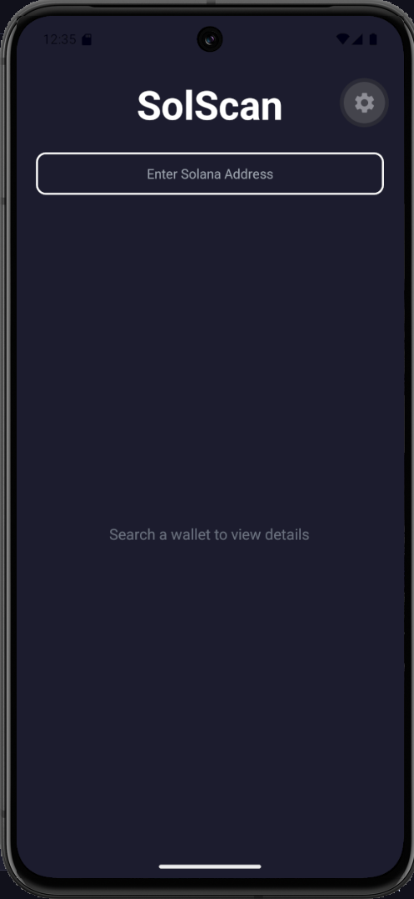
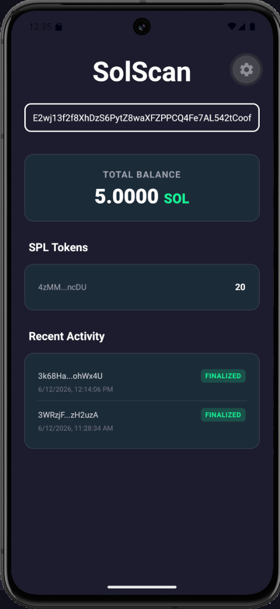

# SolScan Mobile 🪐

A sleek, lightning-fast Solana blockchain explorer built for mobile devices. This application allows users to search any Solana wallet address and instantly view their SOL balance, SPL token holdings, and recent transaction history on the Devnet.

Built completely from scratch using React Native, Expo, and Custom RPC Hooks.




## ✨ Features

* **Instant Wallet Lookups:** Search any Solana address with a clean, responsive UI.
* **Live Balances:** Fetches and formats real-time SOL balances.
* **SPL Token Portfolio:** Displays all associated SPL tokens and their quantities.
* **Transaction History:** View recent network activity with human-readable timestamps and success/failure status badges.
* **Deep Linking:** Tap any transaction to instantly open the detailed breakdown on the official Solana Explorer.
* **Dark Mode Native:** Beautiful, high-contrast UI designed with NativeWind.

## 🛠️ Tech Stack

* **Framework:** [React Native](https://reactnative.dev/) / [Expo](https://expo.dev/)
* **Styling:** [NativeWind](https://www.nativewind.dev/) (Tailwind CSS)
* **Language:** TypeScript
* **Blockchain Data:** [Helius RPC](https://www.helius.dev/) & Solana JSON RPC API

## 📂 Project Structure

```text
├── App.tsx                     # Main application UI and layout routing
├── global.css                  # NativeWind global stylesheet
├── hooks/
│   ├── useSolanaRpc.ts         # Core fetching engine with error handling
│   ├── useWalletBalance.ts     # Parses native SOL balance
│   ├── useTokenBalances.ts     # Fetches associated SPL token accounts
│   └── useTransactionHistory.ts# Retrieves and formats recent signatures
└── tailwind.config.js          # Tailwind styling configuration